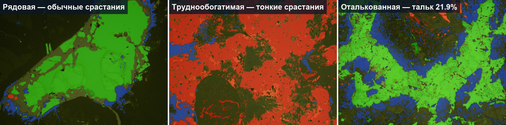
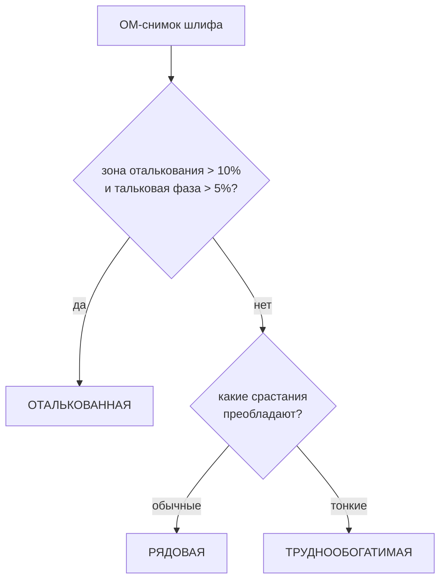
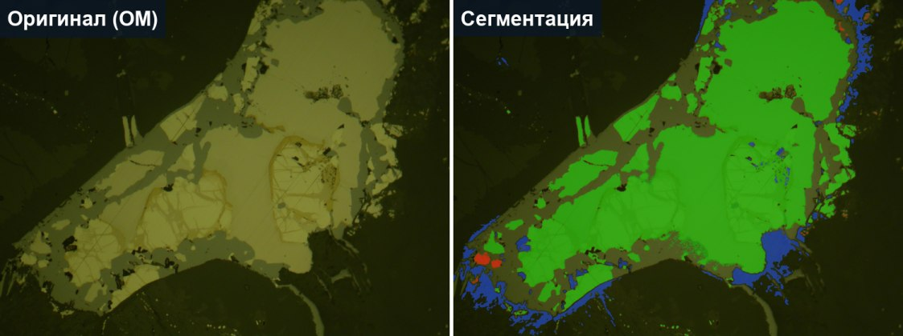
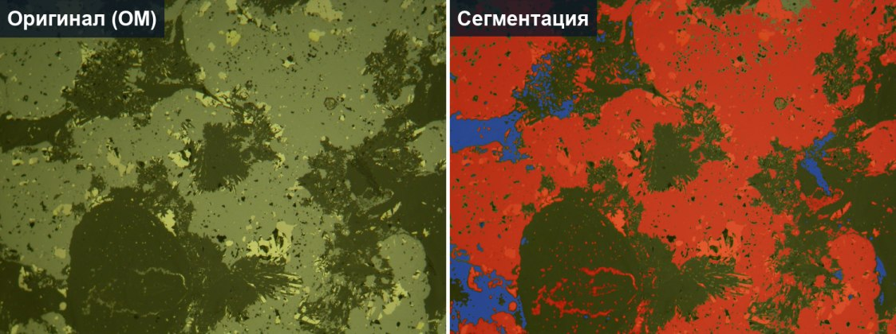
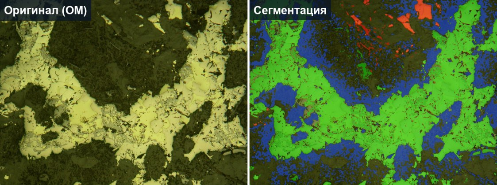
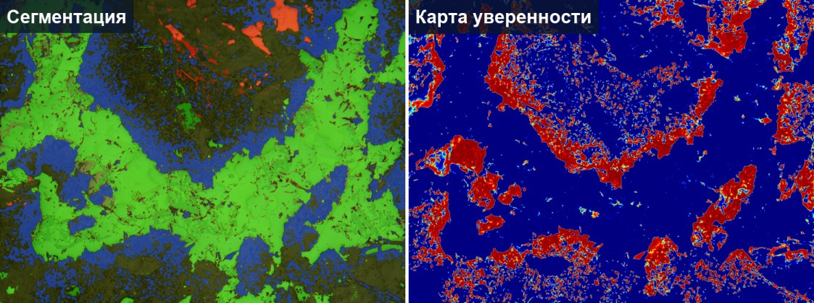
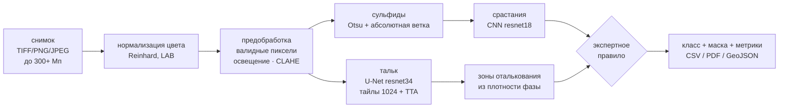
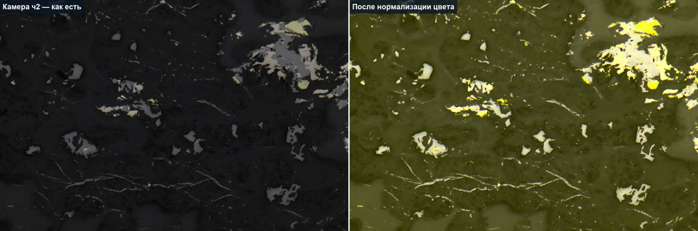

<h1 align="center">OreScope</h1>

<p align="center"><b>Автоматическая классификация руд по панорамным OM-изображениям полированных шлифов</b></p>

<p align="center">
Проект создан за 48 часов на хакатоне <b>Норникель AI Science Hack 2026</b><br/>
задача «Скажи мне, кто твой шлиф»
</p>

<p align="center">


</p>

<p align="center"></p>

---

## Что делает система

Технологический сорт руды сегодня определяет геолог, разглядывая микрофотографии шлифов, — это медленно (часы на образец), субъективно и не масштабируется на партии из сотен снимков. OreScope делает это автоматически: принимает снимок оптической микроскопии (от единичного кадра до панорамы **300+ Мп**), сегментирует фазы и выносит вердикт по экспертному правилу с интерпретируемым результатом — цветовой маской, картой уверенности, таблицей метрик и текстовым заключением.



## Примеры работы

Зелёный — обычные срастания, красный — тонкие срастания, синий — тальк.

**Рядовая** — крупные изолированные сульфиды с минимальным замещением:



**Труднообогатимая** — сульфиды, значительно замещённые нерудной фазой (скелетные, ажурные структуры):



**Оталькованная** — рассеянная тальковая фаза в нерудной матрице:



Для спорных участков система строит карту уверенности — геолог сразу видит, где модели можно верить, а где стоит перепроверить:



## Архитектура



Единая точка входа — `src/pipeline.py:analyze_image`; её используют дашборд, CLI и скрипты оценки.

## Три инженерные находки

### 1. Доменный сдвиг: главная причина ошибок

Датасет снят **двумя разными камерами**: жёлто-зелёный тракт (ч1, на нём вся экспертная разметка талька) и тёмный нейтральный (ч2 и панорамы — целевой домен). Модель, обученная на ч1, была почти слепа к тальку на ч2: верно распознавались лишь **5 из 20** оталькованных проб. Нормализация цветового профиля к референсу обучающего домена (перенос Рейнхарда в LAB, полосами — чтобы влезали панорамы) подняла результат до **14 из 20** — без единой новой размеченной фотографии.



Второй слой той же проблемы: если фотографии «тёмной» камеры участвуют в обучении только как негативы, сеть выучивает шорткат «тёмный тракт → талька нет» и выдаёт нулевую вероятность на весь кадр. Лечится порядком обучения: сначала модель без ч2-негативов, ею — псевдоразметка ч2 с визуальной проверкой, затем финальное обучение на обоих доменах.

### 2. Тальк — это фаза, а порог — про зону

Тальк в шлифе — не сплошное пятно, а **сотни мелких вкраплений**; честная пиксельная площадь фазы обычно меньше 10% даже у явно оталькованной руды. Экспертный же порог «10%» из ТЗ исторически относится к **зонам** оталькования — участкам породы вокруг скоплений вкраплений, которые геолог обводил контуром при разметке. Поэтому система считает оба числа: фазу (честная площадь, MAE 4.75 п.п.) и зону (реконструкция из фазы по локальной плотности, откалибрована по 39 экспертным парам) — и правило 10% применяет к зоне.

### 3. Массивные сульфиды и выравнивание освещения

Классическое выравнивание освещения (вычитание крупномасштабного фона) «съедает» яркие объекты размером в пол-кадра: массивный сульфидный агрегат после вычитания неотличим от матрицы, и детектор давал на таких кадрах **0% сульфидов**. Добавлена абсолютная ветка порога по яркости до выравнивания, заякоренная на статистику матрицы, — на проблемном кадре стало 31% сульфидов (см. пример «Рядовая» выше — это он), на обычных кадрах поведение не изменилось (±1–2 п.п.).

## Метрики (hold-out)

| Метрика | Значение |
|---|---|
| MAE оценки доли талька | **4.75 п.п.** |
| Ложная «оталькованность» на негативных контролях | **0 %** |
| Оталькованные на «слепом» домене ч2 | **14/20** (было 5/20) |
| Классификация типа срастаний, image-level macro-F1 | **0.91** |
| Сорт руды end-to-end, accuracy / macro-F1 | **0.77 / 0.77** |
| Панорама 300 Мп на RTX-GPU | **124 с** (норматив ТЗ ≤ 5 мин) |

Потолок end-to-end объясняется разметкой на уровне *пробы*: единичный кадр не всегда содержит диагностические признаки своего класса. Детальные цифры — `outputs/evaluation.json` после прогона `scripts/evaluate.py`.

## Дашборд

Веб-интерфейс (FastAPI + SPA) с потоком работы лаборатории:

**Общий анализ** (статистика и состав партии) → **Образец шлифа** (маска с зумом и делителем «оригинал/сегментация», карта уверенности, карта срастаний, экспорт CSV / PDF / GeoJSON) → **Экспертная проверка** (образцы с уверенностью < 95% ждут вердикта: подтвердить класс, назначить другой или отклонить) → **Загрузка** новых снимков с очередью автообработки.

При старте сервер сам засевает весь `ore_data/` партиями по эталонным классам и обрабатывает фоновой очередью; результаты персистентны между перезапусками.

## Быстрый старт

Веса рабочих моделей (`models/talc_best.pt`, `models/grain_cnn.pt`) лежат в репозитории через **Git LFS** — переобучение для воспроизведения не нужно.

```bash
git clone https://github.com/SeMe4K-0/OreScope.git && cd OreScope
git lfs install && git lfs pull        # веса моделей (~320 МБ)
pip install -r requirements.txt        # Python 3.11, GPU опционален
python app.py                          # дашборд: http://localhost:7860
```

CLI-анализ одного фото или папки:

```bash
python scripts/analyze.py --input "ore_data/Панорамы" --out outputs/panoramas --um-per-px 1.75
```

<details>
<summary><b>Запуск в Docker</b></summary>

```bash
docker build -t orescope .
docker run -d --name orescope -p 7860:7860 -v ./outputs:/app/outputs orescope

# если веса не запечены в образ — смонтировать томом
docker run -d -p 7860:7860 -v ./models:/app/models -v ./outputs:/app/outputs orescope

# пакетный CLI-прогон внутри контейнера
docker run --rm -v ./ore_data:/app/ore_data:ro -v ./outputs:/app/outputs orescope \
  python scripts/analyze.py --input "ore_data/Панорамы" --out outputs/panoramas
```

CPU-образ ~2.5 ГБ; для GPU — базовый образ `pytorch/pytorch:2.3.0-cuda12.1-cudnn8-runtime` и `--gpus all`. Данные не покидают машину; healthcheck на `/api/batches` встроен.
</details>

<details>
<summary><b>Обучение и калибровка (полная воспроизводимость)</b></summary>

| Скрипт | Назначение |
|---|---|
| `scripts/compute_ref_profile.py` | референсный LAB-профиль домена ч1 для цветонормализации |
| `scripts/make_talc_masks.py` | контуры эксперта → маски тальковой фазы (уточнение «зона → рассеянная фаза», ignore-маски, contact-sheets для проверки) |
| `scripts/train_talc.py` | U-Net талька; Dice+CE с `ignore_index`, сплит по изображениям, `--negatives`, `--neg-domains`, `--extra-dir` |
| `scripts/pseudo_label_ch2.py` | псевдоразметка «ч2/оталькованные» + contact-sheets; `--reject` для отбраковки |
| `scripts/train_grain_cnn.py` | CNN срастаний на weak labels |
| `scripts/sweep_rule.py` | свип порогов экспертного правила по кэшу предсказаний |
| `scripts/evaluate.py` | все метрики одним прогоном |

Воспроизведение модели талька v3 (порядок важен — см. находку №1 про шорткат негативов):

```bash
python scripts/make_talc_masks.py --k-dark 0.6
python scripts/train_talc.py --epochs 40 --negatives 60 --neg-domains ch1
python scripts/pseudo_label_ch2.py            # + визуальная проверка contact-sheets
python scripts/pseudo_label_ch2.py --reject <плохие stem'ы>
python scripts/train_talc.py --epochs 20 --lr 1e-4 --resume models/talc_best.pt \
    --negatives 120 --neg-domains all --extra-dir data/talc_masks_ch2
python scripts/evaluate.py
```
</details>

<details>
<summary><b>Структура данных</b></summary>

Ожидается папка `ore_data/` (в репозиторий не входит — данные хакатона):

```
ore_data/
├── Панорамы/                        # 14 панорам, 46–573 Мп
├── Фото руд по сортам. ч1/          # жёлто-зелёный тракт, 2272×1704
│   ├── Оталькованные руды/
│   │   └── Области оталькования/    # парная экспертная разметка талька
│   ├── Рядовые руды/
│   └── Труднообогатимые руды/
└── Фото руд по сортам. ч2/          # тёмный нейтральный тракт, до 6240×4160
    ├── оталькованные/  рядовые/  тонкие/
```

Куратированная разметка талька (маски фазы + ignore-маски + проверенные псевдомаски ч2) включена в репозиторий: `data/talc_masks/`, `data/talc_ignore/`, `data/talc_masks_ch2/`.
</details>

## Ограничения

- Метки классов — на уровне пробы, не кадра: единичный кадр может не содержать признаков своего класса (потолок e2e-метрики).
- Часть разметки ч2 — верифицированная псевдоразметка; экспертная доразметка этого домена — главный резерв точности.
- Плашка шкалы «300 мкм» на снимках ч2 не маскируется.
- Изображения свыше ~1 Гп потребуют потокового чтения (pyvips).

## Статус проекта

Хакатон завершён — публичное демо остановлено. Проект полностью разворачивается локально за пару минут (см. «Быстрый старт»); план развития и журнал экспериментов — в `docs/TRAINING_PLAN.md`.

---

<p align="center">Норникель AI Science Hack 2026 · задача «Скажи мне, кто твой шлиф»</p>
